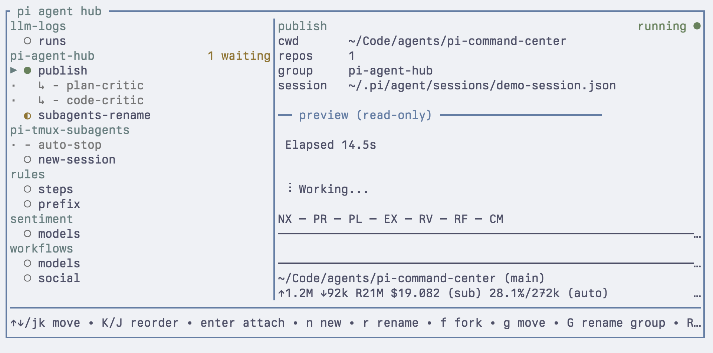

# pi-agent-hub

Pi-native tmux hub for long-running coding-agent sessions, skills, and MCP.

Use `pi-hub` to keep multiple Pi sessions visible, grouped, restartable, and easy to jump between from one terminal dashboard.

New here? See [Features](docs/FEATURES.md) for the dashboard workflow and core capabilities.



## Why pi-agent-hub?

Most agent managers try to become the runtime. `pi-agent-hub` stays small: Pi runs the agents, tmux keeps them alive, and the hub gives you one keyboard-driven dashboard to manage them.

| Feature | Why it matters |
| --- | --- |
| Pi-native | Uses Pi sessions, extensions, skills, MCP, and project state directly. |
| tmux-native | Sessions keep running as normal tmux sessions; you can attach, switch, or recover manually. |
| One stable dashboard | `pi-hub` always brings you back to the same control center. |
| Return shortcuts | `Ctrl+Q` jumps from a managed session back to the dashboard; `Alt+R` opens rename from inside a session. |
| Project-scoped skills/MCP | Pick skills and MCP servers for the selected session's primary repo. |
| Multi-repo workspaces | Extra repos are symlinked into a runtime workspace; source repos are not moved or owned. |
| Hub-owned worktrees | Create isolated one-repo branch sessions from the new-session form; finish, forget, or discard them explicitly from the dashboard. |
| Small surface area | No cloud service, no custom agent runtime, no hidden repo scanning. |

## Quick start

Requirements: Pi, Node.js 20+, and tmux 3.1+.

```bash
npm install -g pi-agent-hub
pi-hub doctor
pi-hub
```

Inside the dashboard:

| Key | Action |
| --- | --- |
| `n` | Create a new Pi session |
| `Enter` | Open or switch to the selected session |
| `/` | Filter sessions |
| `p` | Send a one-line message to the selected live session without opening it |
| `?` | Show help and status legend |
| `q` | Quit the dashboard |
| `r` | Open restart choices (`r` selected, `n` new conversation, `a` all) |
| `R` | Rename the selected session |
| `d` | Delete or forget the selected session |
| `f` | Fork the selected session |
| `a` | Mark the selected waiting session read |
| `A` / `B` / `U` | Archive, move to Backlog, or restore the selected session |
| `w` | Finish a hub-owned worktree session |
| `N` | Sync the selected hub title from Pi's `/name` |
| `↑↓` / `j` / `k` | Move selection |
| `g` / `G` | Move a session to a group or rename its group |
| `K` / `J` | Move the selected session up/down within its group |
| `s` / `m` | Pick project skills or MCP servers; `←→` switches Enabled/Available |

## Install

The npm package is `pi-agent-hub`; it exposes both commands, with `pi-hub` as the shorter daily-use command and `pi-agent-hub` kept for compatibility. Most users install the CLI with npm:

```bash
npm install -g pi-agent-hub
```

If you also install or update the package through Pi (`pi install npm:pi-agent-hub`), Pi updates its package copy under `~/.pi/agent/npm/node_modules/pi-agent-hub`. If an older global npm `pi-hub` appears earlier on `PATH`, your shell can still run the stale dashboard. Run `pi-hub doctor` after install/update and follow any `cli package` warning.

POSIX shell fix:

```bash
mkdir -p ~/.local/bin
ln -sf ~/.pi/agent/npm/node_modules/.bin/pi-hub ~/.local/bin/pi-hub
# ensure ~/.local/bin appears before the global npm bin in PATH
```

Windows PowerShell fix:

```powershell
$PiBin = "$env:USERPROFILE\.pi\agent\npm\node_modules\.bin"
# Add $PiBin before the global npm prefix in your user PATH, then reopen the terminal.
# Or run: & "$PiBin\pi-hub.cmd" doctor
```

For local development, see [Development](docs/DEVELOPMENT.md).

## Common commands

```bash
pi-hub              # create/attach/switch to the dashboard tmux session
pi-hub tui          # run the TUI directly in the current terminal
pi-hub doctor
pi-hub list
pi-hub add . -t api -g default
pi-hub add ./api -t fullstack --add-cwd ../web --add-cwd ../shared
pi-hub delete <session-id>
pi-hub mcp-pool     # run the pooled MCP socket daemon
pi-hub config get
pi-hub config set session-prelude '<shell snippet>'
pi-hub config unset session-prelude
```

`add --add-cwd` creates a multi-repo session: `cwd` stays the primary repo, extra paths are symlinked into a per-session workspace, and Pi starts from that workspace. Worktree sessions are created from the TUI new-session form with `Ctrl+T`; the branch name is also the session title. `delete` stops the tmux session if it is still alive, removes the registry row, removes the heartbeat file, and removes any owned multi-repo workspace. Dashboard archive/backlog/restore only reorganizes rows and never stops tmux or Pi; archived rows are forgotten after 72 hours only once their tmux sessions are gone. Pi conversation/session files, source repos, and hub-owned worktree directories are kept by normal delete; use dashboard `w` to merge and remove a clean hub-owned worktree, or `d` then `Shift+D` to discard a clean worktree and branch without merging.

## Troubleshooting

For SSH/tmux use, mouse behavior comes from the remote tmux server. If right-click pastes or the scroll wheel cycles prompt history instead of interacting with the dashboard/session, enable tmux mouse support:

```tmux
set -g mouse on
```

For better modified-key handling, also enable extended keys if your tmux version supports it:

```tmux
set -g extended-keys on
```

`pi-agent-hub` does not force these global tmux settings.

## Documentation

- [Features](docs/FEATURES.md): dashboard workflow, keybindings, groups, status vocabulary, multi-repo workspaces, and worktree behavior.
- [Configuration](docs/CONFIG.md): runtime state, global config, Skills/MCP selection, themes, and state paths.
- [Development](docs/DEVELOPMENT.md): local setup, tests, package checks, and smoke testing.
- [Structure](docs/STRUCTURE.md): project layout and architecture notes for contributors.

## Acknowledgements

Thanks to [Ashesh Goplani](https://github.com/asheshgoplani) for [Agent Deck](https://github.com/asheshgoplani/agent-deck). This project ports its core session-dashboard idea into a smaller Pi-native extension. It is not affiliated with Agent Deck. See `LICENSE` for the Agent Deck MIT notice.
