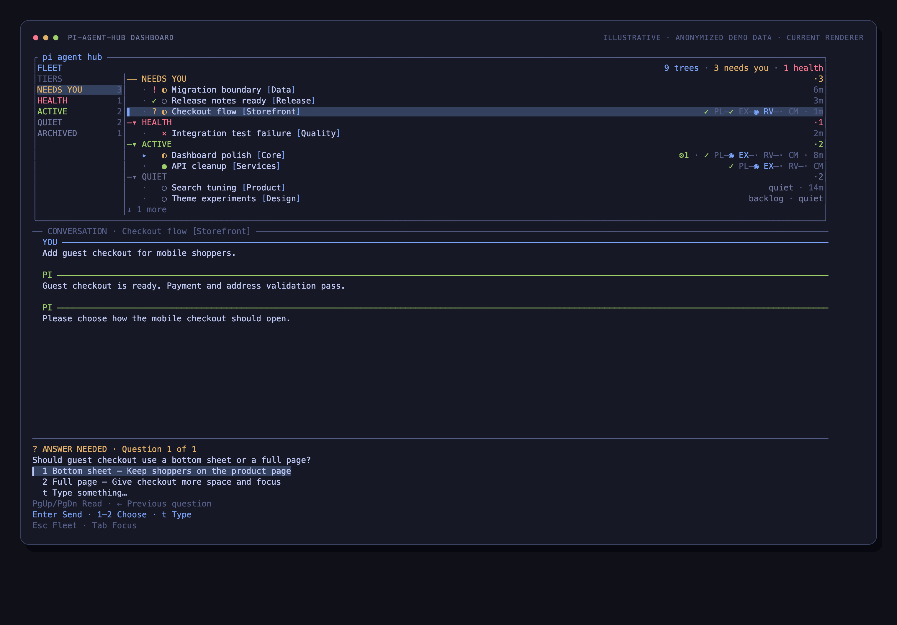

# pi-agent-hub

Pi-native tmux hub for long-running coding-agent sessions, skills, and MCP.

Use `pi-hub` to keep multiple Pi sessions visible, grouped, restartable, and easy to jump between from one terminal dashboard.

New here? See [Features](docs/FEATURES.md) for the dashboard workflow and core capabilities.



## Why pi-agent-hub?

Most agent managers try to become the runtime. `pi-agent-hub` stays small: Pi runs the agents, tmux keeps them alive, and the hub gives you one keyboard-driven dashboard to manage them.

| Feature | Why it matters |
| --- | --- |
| Pi-native | Uses Pi sessions, extensions, skills, MCP, and project state directly. |
| tmux-native | Sessions keep running as normal tmux sessions; you can attach, switch, or recover manually. |
| One stable dashboard | `pi-hub` always brings you back to the same control center. |
| Return shortcuts | `Alt+Q` returns and completes the coached first request round trip; `Ctrl+Q` returns without completing it; `Alt+R` opens rename from inside a session. |
| Project-scoped skills/MCP | Pick skills and MCP servers for the selected session's primary repo. |
| Multi-repo workspaces | Extra repos are symlinked into a runtime workspace; source repos are not moved or owned. |
| Hub-owned worktrees | Create isolated branch sessions for one or more repos; finish, forget, or discard them explicitly from the dashboard. |
| Small surface area | No cloud service, no custom agent runtime, no hidden repo scanning. |

## Quick start

Requirements: Pi 0.84.4+, Node.js 22.19+, and tmux 3.1+.

```bash
npm install -g pi-agent-hub
pi-hub doctor
pi-hub
```

Common dashboard keys (see [Features](docs/FEATURES.md#dashboard-keys) for the full map):

| Key | Action |
| --- | --- |
| `n` | Create a new Pi session |
| `Enter` | Below 120 columns, open the selected session's action workspace first; at 120+ columns, open/switch directly or restart a stopped/error session |
| `1`–`4` | Pin the selected live session into that exact free slot; an occupied slot is never replaced |
| `P` | Pin into the lowest free slot, or focus the selected session's existing slot |
| `Alt+1`–`Alt+4` | Focus the corresponding occupied slot from the sidebar or a live pane |
| `x` | Close the selected session's pin without stopping Pi |
| `+` / `-` | Resize the main pin split in ten-point steps |
| `Alt+Q` / `Ctrl+Q` | Return from a live pane to the sidebar; only `Alt+Q` completes first-run coaching |
| `/` | Filter sessions |
| `:` | Search actions, sessions, and named filters |
| `p` | Send a one-line message to the selected live session without opening it |
| `?` | Show help and status legend |
| `i` | Explain the selected session's runtime status and cockpit placement |
| `S` | Toggle the project cockpit ↔ read-only workflow board |
| `q` | Quit the dashboard |
| `r` | Open restart choices (`r` selected, `n` new conversation, `a` all active sessions) |
| `R` | Rename the selected session |
| `d` | Delete or forget the selected session |
| `f` | Fork the selected session |
| `Shift+F` | Choose a group, fork, name the new Pi session from its primary repo, clear inherited ticket/workflow metadata, and compact |
| `a` | Mark the selected waiting session read |
| `A` / `B` / `U` | Archive and close its pin if shown, move to Backlog, or restore the selected session |
| `w` | Finish a hub-owned worktree session |
| `N` | Sync the selected hub title from Pi's `/name` |
| `↑↓` / `j` / `k` | Move selection |
| `←` / `→` | Collapse or expand the selected subagent tree; add Shift for all trees |
| `g` / `G` | Move a session to a group (Ctrl+N/P cycles visible groups) or rename its group |
| `K` / `J` | Move the selected Active/Backlog session up/down within its group |
| `s` / `m` | Pick project skills or MCP servers; `←→` switches Enabled/Available |
| Click / double-click | Select / open the action workspace below 120 columns, or open/switch/restart directly at 120+ |

The default project cockpit shows complete session trees in attention order: `NEEDS YOU`, `HEALTH`, `ACTIVE`, `QUIET`, then chronological `ARCHIVED`. Only explicit producer attention on a waiting/idle owner enters `NEEDS YOU`; waiting alone does not. A running child can activate its owner tree, but child attention/error never promotes the parent. A hidden child request instead adds `?N child` to its tier and `?N` to its owning row whenever the request row is absent from the visible projection; each count disappears when that request row becomes visible. Runtime status, workflow position, lifecycle, attention, and child activity remain independent. Groups and Backlog appear as row metadata, while Archived remains the only collapsible project section.

A fresh producer request with a request ID adds one six-second band below the cockpit header and a focus-aware tmux message. Click the band or choose **Locate newest request** from `:` to reveal its exact session without opening or acknowledging it. The optional **Attention bell** toggle also lives in `:` and defaults to Off.

On a new empty dashboard, the real cockpit tiers and footer teach one daily loop: create a session, open an explicit request, and return with `Alt+Q`. That coaching retires after the first successful request round trip. Existing users see only one low-priority **NEW DAILY LOOP** row below real attention; select it and press `Enter` to dismiss it.

The fleet top line names `FLEET`, `WORKFLOW`, or `PINNED FLEET`, then shows owner-tree, pin, `needs you`, and health signals that fit. A full-width workspace starts with the selected session instead of adding another mode header. With a filter active, tree counts use visible/total form. `▸` marks a collapsed owner with child rows; press `→` to expand it to `▾`, and `←` to collapse it again.

The selected-session action workspace shows positive decision content only: identity, an explicit request, real task text, plain workflow position, exceptional guidance, and enabled target-bound actions. Empty categories and duplicate runtime narration disappear. `▸` marks the primary action chosen by the same catalog policy that supplies every workspace command. Raw tmux pane output and Pi conversation content never enter this workspace. The workspace is persistent at 120+ columns. Below 120 columns, the first `Enter` or double-click opens it without attaching or acknowledging; `Enter` inside the workspace runs Open/Restart and `Escape` returns to the fleet. Workspace action rows also support a single mouse click.

Press `i` to append `LIVE DETAILS` in the same workspace: useful tmux, heartbeat, read-state, runtime-placement, and workflow evidence. Routine absence text is suppressed. Missing evidence refreshes through the normal observation path before display. Press `i` again to hide details.

Press `:` to search the same actions exposed by direct keys, jump to sessions through bounded title/group/project/task/ticket/attention/workflow context, or apply named lifecycle, status, and group filters. Unavailable actions remain visible with a reason. Selecting a session only reveals and selects its current row in Hub; it does not attach, restart, or mark it read. `/` remains the fast free-text fleet filter, and `?` remains direct Help.

The cockpit uses one adaptive hierarchy whose card richness is derived per render, not saved as a view setting. Active parent sessions gain bounded request, ticket, and group continuation lines as space permits; Backlog and Archived parents remain single-line, and subagents use compact micro rows. At 100+ columns, rich project and board trees use a `│`/`└` gutter. The whole visible owner tree receives the selection background, while `▌` still identifies the exact keyboard and action target. At the right edge of Active parent rows, hidden requests survive width pressure longest, followed by active descendants, workflow, and age; Backlog and Archived retain their lifecycle-specific tails. A mouse-only five-tier navigator shows presentation-owner counts and jumps to the first visible owner without entering keyboard session order. It is hidden in the workflow board, pin mode, narrow layouts, and full-screen workspace.

`S` switches to the read-only workflow board, where compatible Active workflow trees stay in producer-defined lanes and all others appear in `OTHER ACTIVE`, nested under their existing group labels. At 100+ columns, board cards add producer activity and an eight-cell `■`/`□` plan bar when valid progress exists; narrow boards keep one-line cards. Top-level parents show `⚙︎N` for starting/running descendants. Subagent trees start collapsed in both views: `←`/`→` changes the selected tree, Shift applies to all trees, and `Space` remains a board selected-tree toggle. Filters reveal matching child context without changing tier or disclosure state. The selected-session workspace keeps producer workflow facts separate from exceptional Hub guidance.

## Install

The npm package is `pi-agent-hub`; it exposes both commands, with `pi-hub` as the shorter daily-use command and `pi-agent-hub` kept for compatibility. Most users install the CLI with npm:

```bash
npm install -g pi-agent-hub
```

If you also install or update the package through Pi (`pi install npm:pi-agent-hub`), Pi updates its package copy under `~/.pi/agent/npm/node_modules/pi-agent-hub`. If an older global npm `pi-hub` appears earlier on `PATH`, your shell can still run the stale dashboard. Run `pi-hub doctor` after install/update and follow any `cli package` warning.

POSIX shell fix:

```bash
mkdir -p ~/.local/bin
ln -sf ~/.pi/agent/npm/node_modules/.bin/pi-hub ~/.local/bin/pi-hub
# ensure ~/.local/bin appears before the global npm bin in PATH
```

Windows PowerShell fix:

```powershell
$PiBin = "$env:USERPROFILE\.pi\agent\npm\node_modules\.bin"
# Add $PiBin before the global npm prefix in your user PATH, then reopen the terminal.
# Or run: & "$PiBin\pi-hub.cmd" doctor
```

For local development, see [Development](docs/DEVELOPMENT.md).

## Common commands

```bash
pi-hub              # create/attach/switch to the dashboard tmux session
pi-hub tui          # run the TUI directly in the current terminal
pi-hub doctor
pi-hub list
pi-hub explain <session-id-or-unique-prefix>
pi-hub add . -g default
pi-hub add ./api --add-cwd ../web --add-cwd ../shared
pi-hub delete <session-id>
pi-hub mcp-pool     # run the pooled MCP socket daemon
pi-hub config get
pi-hub config set session-prelude '<shell snippet>'
pi-hub config unset session-prelude
pi-hub config set worktree-default true
pi-hub config unset worktree-default
```

`explain` observes the live fleet once and prints the same runtime and cockpit reasoning as the dashboard. It resolves an exact session ID before a unique prefix, reports bounded candidates for ambiguous prefixes, and never updates `registry.json`.

`add --add-cwd` creates a multi-repo session: `cwd` stays the primary repo, extra paths are symlinked into a per-session workspace, and Pi starts from that workspace. Worktree sessions are created from the TUI new-session form by focusing the Worktree row and pressing `Space`, or with `Ctrl+T`; the branch does not control Pi's native session name. New forms start with worktrees on. Set `worktree-default false` to open them in normal-session mode instead; either toggle can still change the mode per session. `delete` stops the tmux session if it is still alive, removes the registry row, removes the heartbeat file, and removes any owned multi-repo workspace. Dashboard archive/backlog/restore never stops tmux or Pi; archiving also closes the session's pin if shown. Archived is a flat newest-first list that shows five parent cascades by default; select the older-items row and press `Enter` or double-click to expand it. Archived cascades become eligible for dashboard cleanup after seven days, but are forgotten only when every tmux session in the cascade is confirmed gone. Pi conversation/session files, source repos, and hub-owned worktree directories are kept by normal delete; use dashboard `w` to merge and remove a clean hub-owned worktree, or `d` then `Shift+D` to discard a clean worktree and branch without merging.

## Troubleshooting

For SSH/tmux use, mouse behavior comes from the remote tmux server. Hub enables tmux mouse mode only on the dashboard session while `pi-hub` is running, then unsets that session override on quit so your global tmux preference applies again. It does not force global tmux mouse settings.

For better modified-key handling, enable extended keys globally if your tmux version supports it:

```tmux
set -g extended-keys on
```

`Alt+1`–`Alt+4` is the primary fast path Hub reserves for slot focus. `Alt+Arrow` remains an optional spatial alias, but terminal applications such as Ghostty can map `Alt+Left` and `Alt+Right` to word movement before tmux sees modified arrows. Use numeric focus or your tmux prefix plus arrows instead of overriding useful terminal editing keys.

## Documentation

- [Features](docs/FEATURES.md): dashboard workflow, keybindings, groups, status vocabulary, multi-repo workspaces, and worktree behavior.
- [Configuration](docs/CONFIG.md): runtime state, global config, Skills/MCP selection, themes, and state paths.
- [Development](docs/DEVELOPMENT.md): local setup, tests, package checks, and smoke testing.
- [Structure](docs/STRUCTURE.md): project layout and architecture notes for contributors.

## Acknowledgements

Thanks to [Ashesh Goplani](https://github.com/asheshgoplani) for [Agent Deck](https://github.com/asheshgoplani/agent-deck). This project ports its core session-dashboard idea into a smaller Pi-native extension. It is not affiliated with Agent Deck. See `LICENSE` for the Agent Deck MIT notice.
